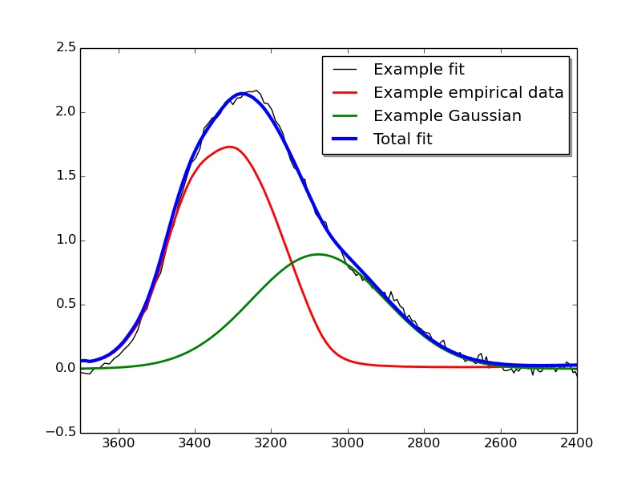
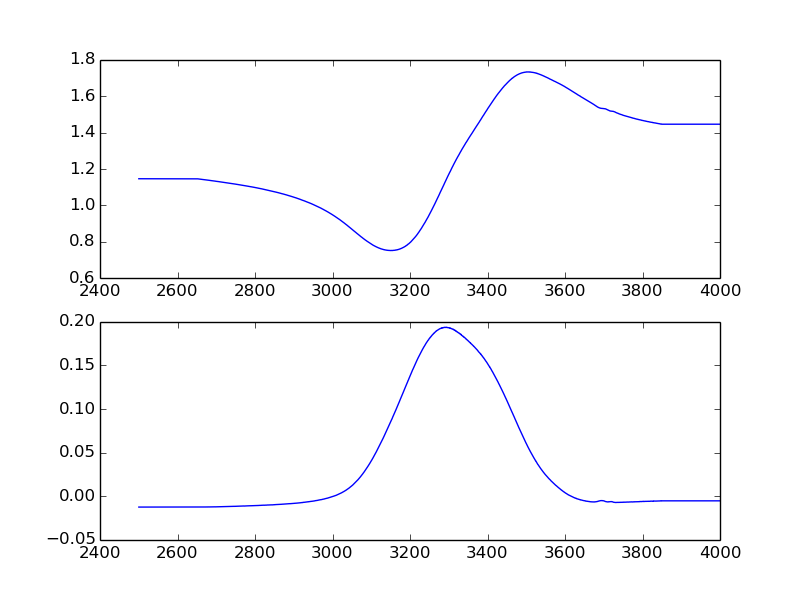

Examples
========
This page lists examples of likely ways to make use of Omnifit.

.. _example-full-fit:

Fitting from start to finish
----------------------------
The code snippet below shows how one might go about fitting a target spectrum with an empirically acquired spectrum and a Gaussian function, and the both export the raw fit results and plot them.

The target spectrum data is assumed to originate from a file which consists of two columns of data. The first column contains the wavelength and the second column contains the optical depth of an observed spectrum. For information on how you can use Omnifit to acquire such a complex refractive index spectrum, see the :ref:`example on Kramers-Kronig iteration <example-kramers-kronig>`. You can download the observational data file used in this example from :download:`here <./_files/obsdata.csv>`.

The empirical spectrum being fitted to this, by contrast, is assumed to be a file containing set of data describing the complex refractive index of an ice. The first column of this file contains the frequency of the spectrum (in reciprocal wavenumbers), and the second and third columns containing the real and imaginary parts of the complex refractive index. You can download the laboratory data file used in this example from :download:`here <./_files/labdata.csv>`.

.. code-block:: python
  :linenos:

  import numpy as np
  from omnifit.spectrum import AbsorptionSpectrum,CDESpectrum
  from omnifit.utils import unit_od
  import astropy.units as u
  from omnifit.fitter import Fitter
  from lmfit import Parameters
  obs_wl,obs_od = np.loadtxt('./obsdata.csv',dtype=float,delimiter=',',usecols=(0,1)).T
  lab_wn,lab_n,lab_k = np.loadtxt('./labdata.csv',dtype=float,delimiter=',',usecols=(0,1,2)).T
  obs_spec = AbsorptionSpectrum(obs_wl*u.micron,obs_od*unit_od,specname='Observed data')
  lab_spec = CDESpectrum(lab_wn,lab_n,lab_k,specname='Laboratory data')
  interp_lab = lab_spec.interpolate(obs_spec,clone=True)
  fitter_example = Fitter.fromspectrum(obs_spec,modelname='Example fit')
  lab_par = Parameters()
  lab_par.add('mul',value=0.5,min=0.0)
  fitter_example.add_empirical(interp_lab,lab_par,funcname='Example empirical data')
  theory_par=Parameters()
  theory_par.add_many(('peak',  2.5,   True, 0.0,        None,       None),
                      ('pos',   3000., True, 3000.-200., 3000.+200., None),
                      ('fwhm',  50.0,  True, 0.0,        None,       None))
  fitter_example.add_analytical('gaussian',theory_par,funcname='Example Gaussian',color='g')
  fitter_example.perform_fit()
  fitter_example.fitresults_tofile('example_fitres')
  import matplotlib.pyplot as plt
  ax = plt.subplots()
  fitter_example.plot_fitresults(ax[1])
  ax[1].set_xlim(3700.,2400.)
  plt.savefig('example_fitres.png')

In this, lines 1-6 import the various components needed for the full fit.
Lines 7 and 8 read the spectrum data from the two files which contain the target spectrum and the complex refractive index spectrum.

Line 9 initialises the target spectrum as an absorption spectrum using the data read in line 7, and line 10 initialises the CDE-corrected spectrum using the data read in line 8.

Line 11 interpolates the data in the CDE-corrected spectrum to match the spectral resolution of the fitting target spectrum, which is also used to initialise the fitter on line 12.

Lines 13 and 14 prepare the fitting parameters for an empirical data, containing only an initial guess (0.5) for the best-fit multiplier. These parameters and the data to be fitted are then given to the fitter on line 15.

Similarly lines 16-19 involve setting up the initial guess and constrains on the parameters for a Gaussian fit, which are then given to the fitter (with instruction to try and fit a Gaussian) on line 20.

Line 21 is used to make the fitting itself happen. After it is done, the command on line 22 can be called to produce two files, example_fitres.csv and example_fitres.xml, which contain all the information on the fit results, as documented in `omnifit.fitter.Fitter.fitresults_tofile`.

Finally, lines 23-27 are used to produce a plot of the fit results in the file example_fitres.pdf.

The plotted file should look something like this:

.. _example-kramers-kronig:

Kramers-Kronig relation
-----------------------

This snippet of code is an example of how to make use of the Kramers-Kronig iteration method in Omnifit to use transmission data of an ice grown in a laboratory setting to calculate the complex refractive index of said ice. This complex refractive index spectrum can then be used in the initialisation of e.g. a CDE-corrected spectrum, such as the one used in the :ref:`example on fitting from start to finish <example-full-fit>`.

The laboratory data is assumed to originate from a file which consists of two columns of data. The first column contains the frequency (in cm^-1) and the second column contains the absorbance of an ice spectrum grown in a laboratory. In this data the absorption of the substrate has been baselined out of the spectrum, leaving the absorption of the ice itself as the only source of absorbance. You can download the laboratory data file used in this example from :download:`here <./_files/labdata_raw.csv>`.

.. code-block:: python
  :linenos:

  from omnifit import utils
  import astropy.units as u
  import numpy as np
  import matplotlib.pyplot as plt
  d_ice = 1.5*u.micron
  m0 = 1.3+0.0j
  with u.set_enabled_equivalencies(u.equivalencies.spectral()):
        freq_m0 = (0.5*u.micron).to(u.kayser).value
  m_substrate = 1.4+0.0j
  freq,absorbance = np.loadtxt('labdata_raw.csv',delimiter=', ',skiprows=0,unpack=True)
  freq *= u.kayser
  absorbance *= utils.unit_absorbance
  transmittance = absorbance.to(utils.unit_transmittance,equivalencies=utils.equivalencies_absorption)
  cropind = np.logical_and(freq.value>=2500.,freq.value<=4000.)
  freq = freq[cropind]
  transmittance = transmittance[cropind]
  m_ice = utils.kramers_kronig(freq,transmittance,m_substrate,d_ice,m0,freq_m0)
  fig = plt.figure()
  ax1,ax2 = fig.add_subplot(211),fig.add_subplot(212)
  ax1.plot(freq,m_ice.real)
  ax2.plot(freq,m_ice.imag)
  plt.savefig('example_kk.png')

In this, lines 1-4 import the various components needed for the iteration.

Lines 5-9 are used for defining the additional variables used in the iteration. Specifically, the thickness of the ice is assumed to be 1.5 microns, and its complex refractive index is assumed to be 1.3+0j at a wavelength of 0.5 microns (which is at a high frequency compared to the 3-micron water ice feature being looked at). The complex refractive index of the substrate is assumed to be 1.3+0j throughout the frequency range.

Line 10 reads the file containing the absorbance data, with lines 11 and 12 converting the read data to astropy-compatible quantities. Then line 13 is used to convert the absorbance into transmittance using the absorption equivalencies of Omnifit.

Lines 14-16 crop the raw data to contain only the 3-micron feature which is the main feature of interest in this iteration. Cropping the data in this way also cuts down on the computational time requirements of the KK iteration.

Line 17 calls the Kramers-Kronig iteration function of Omnifit, using the data and variables described above. After about a little while of calculation the function returns the converged complex refractive index of the ice, and stores it in the variable m_ice.

Finally, lines 18-22 are used to plot the complex refractive index in two subplots (one for n, another for k) as a function of frequency.

The plotted file should look something like this:

