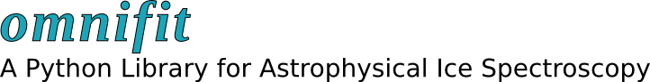

.. Much of what is found below has been shamelessly copied from the astropy documentation layout.

.. the "raw" directive below is used to hide the title in favor of just the logo being visible
.. raw:: html

    

#############################
Omnifit Package Documentation
#############################

.. raw:: html

   

.. only:: latex

    .. image:: _static/omnifit_banner.pdf

Welcome to the Omnifit documentation!

************
Introduction
************
.. only:: html

    :doc:`whatsnew/0.1`
    -------------------

.. only:: latex

    .. toctree::
       :maxdepth: 1

       whatsnew/0.1

**Omnifit basics**

.. toctree::
  :maxdepth: 1

  overview
  examples

*************
Reference/API
*************
Spectrum
========
  .. automodapi:: omnifit.spectrum
Fitter
========
  .. automodapi:: omnifit.fitter
Utils
=====
  .. automodapi:: omnifit.utils